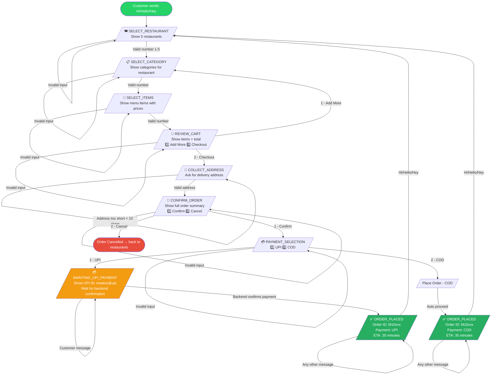

# Mealoo WhatsApp Order Flow

## States

| State | Trigger | Next State |
|---|---|---|
| `SELECT_RESTAURANT` | Hi / Hello / Hey | — |
| `SELECT_CATEGORY` | Valid restaurant number | — |
| `SELECT_ITEMS` | Valid category number | — |
| `REVIEW_CART` | Valid item number | — |
| `COLLECT_ADDRESS` | Send `2` from cart | — |
| `CONFIRM_ORDER` | Address entered | — |
| `PAYMENT_SELECTION` | Send `1` to confirm | — |
| `AWAITING_UPI_PAYMENT` | Send `1` (UPI) | — |
| `ORDER_PLACED` | COD auto / UPI backend confirm | — |

## Endpoints

| Method | Path | Purpose |
|---|---|---|
| `POST` | `/webhook/whatsapp` | Twilio incoming message |
| `POST` | `/webhook/payment/confirm?phone=` | Backend UPI payment confirmation |

## Error Handling

- Invalid menu selection → repeat current step
- Address < 10 chars → ask again
- UPI: order only placed after backend confirms payment
- Greetings at any state → reset session and restart
